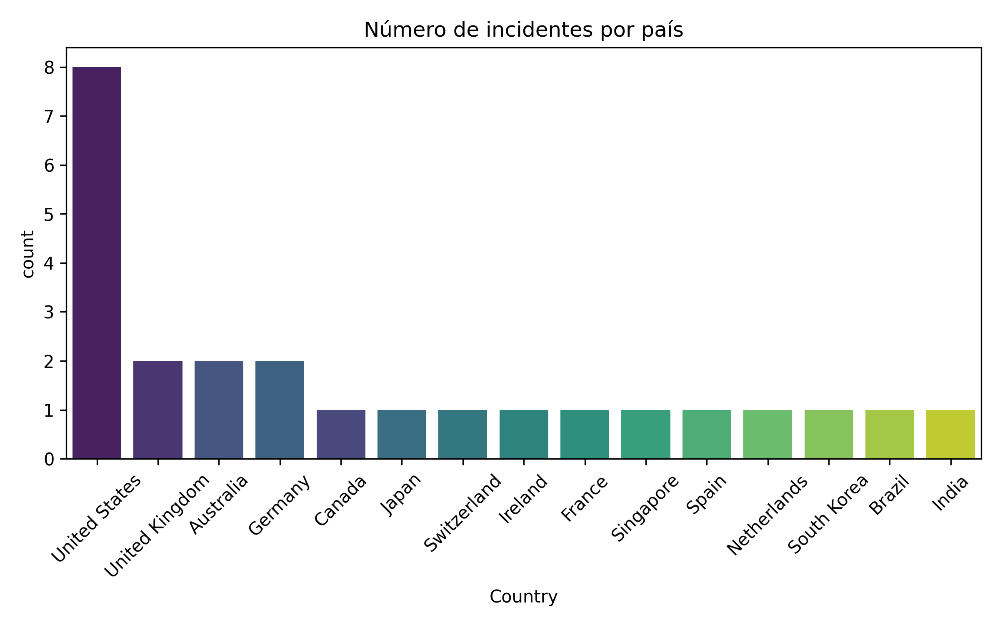
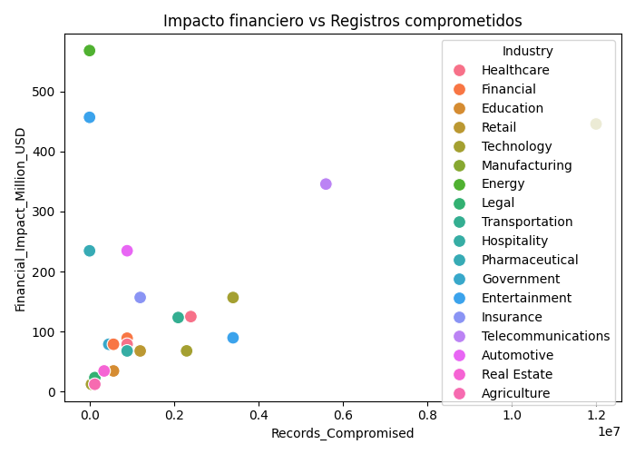
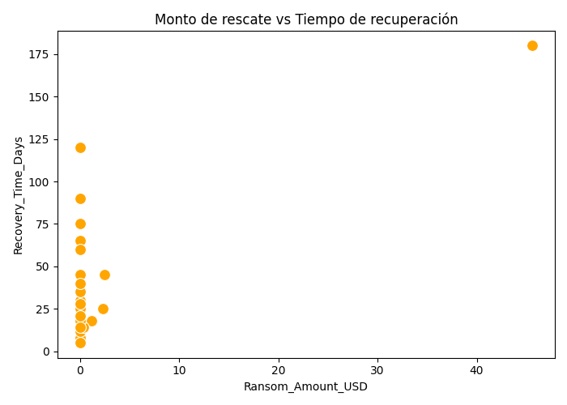
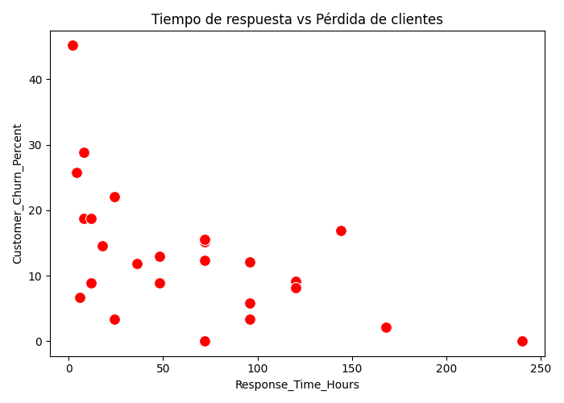
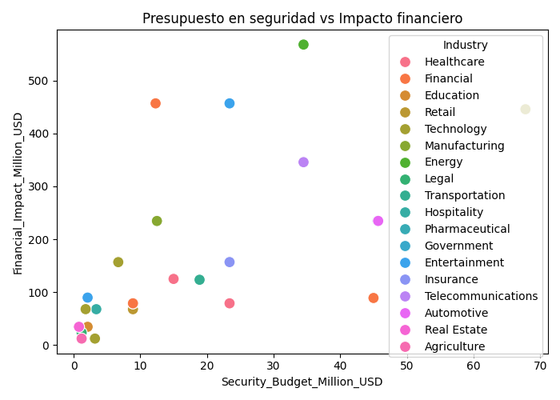

# Trabajo3B

# 🔐 **Cybersecurity Incidents & Data Breaches 2024**  

Este proyecto utiliza el dataset **“Cybersecurity Incidents & Data Breaches 2024”**, que recopila 25 incidentes relevantes de ciberseguridad y filtraciones de datos reportados durante 2024 en diversas industrias y países. 

Cada registro incluye detalles sobre el ataque (tipo, vector de entrada, datos comprometidos), impacto financiero, tiempos de recuperación, multas regulatorias, así como factores internos de la organización (estado de parches, uso de MFA, presencia de CISO, horas de capacitación en seguridad y presupuesto asignado).

## 🎯 **1) Propósito del dataset**  
Este conjunto de datos es valioso para:
- Analizar **factores de riesgo** en organizaciones.
- Identificar **tendencias de ataques** por país e industria.
- Explorar **correlaciones** entre inversión en seguridad, impacto financiero, pérdida de clientes y tiempos de respuesta.

## 📌 **2) Variables clave seleccionadas**
En este análisis se priorizan las siguientes columnas por su relevancia:

1. **Industry**: Sector afectado (ej. Tecnología, Financiero, Salud).  
2. **Country**: País en donde ocurrió el incidente.  
3. **Attack_Type**: Tipo de ataque.  
4. **Attack_Vector**: Método de ingreso.  
5. **Records_Compromised**: Número de registros comprometidos.  
6. **Recovery_Time_Days**: Días en recuperarse del incidente.  
7. **Financial_Impact_Million_USD**: Pérdidas monetarias directas.  
8. **Security_Budget_Million_USD**: Presupuesto en seguridad.  
9. **Employee_Count**: Número de empleados.  
10. **Response_Time_Hours**: Tiempo de respuesta en horas.  
11. **Customer_Churn_Percent**: Porcentaje de pérdida de clientes.  

Estas variables permiten entender cómo factores internos (empleados, presupuesto, seguridad) se relacionan con el impacto y la resiliencia ante ataques.

## 🧹 **3) Limpieza y transformación de datos**
Antes del análisis exploratorio se realizaron las siguientes etapas de procesamiento:

1. **Eliminación de duplicados**: Se revisó y eliminó cualquier registro repetido para garantizar consistencia.  

2. **Conversión de tipos**: Se validó que las columnas numéricas y categóricas tengan el tipo de dato correcto.  

3. **Normalización de valores**: Se revisaron categorías con diferencias ortográficas o de formato para unificarlas.

## 📊 **4) Principales hallazgos del EDA**
- **Distribución geográfica e industrial**:  
  Estados Unidos concentra la mayor cantidad de incidentes (8 casos) en múltiples sectores: tecnología, finanzas, salud, entre otros.  

      
  *Figura 1. Distribución de incidentes por país en 2024.*  

- **Correlaciones relevantes**:  
  - *Impacto financiero:* correlaciona con `Records_Compromised` y `Response_Time_Hours`. 

    
    *Figura 2. Relación entre registros comprometidos y pérdidas financieras.* 

  - *Ransom_Amount_USD:* se relaciona con `Recovery_Time_Days`. 

    
    *Figura 3. Un mayor monto de rescate suele alargar los tiempos de recuperación.*  

- **Impacto en clientes y reputación**:  
  La pérdida de clientes (`Customer_Churn_Percent`) se incrementa cuando los tiempos de respuesta y recuperación son altos, afectando directamente los ingresos y sostenibilidad de la empresa.

    
  *Figura 4. Relación entre tiempos de respuesta y pérdida de clientes.*  

  **Relación inversión–pérdidas**:  
  Organizaciones con menor `Security_Budget_Million_USD` tienden a presentar mayor impacto financiero.  

    
  *Figura 5. Inversión en seguridad vs pérdidas financieras.*  

## ✅ **5) Conclusiones**
- **Tiempo y datos críticos**: La rapidez en responder a un ataque y la protección de datos de clientes son factores clave para evitar pérdidas financieras y de reputación.  
- **Pago de rescates**: En algunos casos, las organizaciones se ven obligadas a pagar rescates (incluso en criptomonedas), lo cual retrasa la recuperación y genera riesgos legales y reputacionales.  
- **Importancia del área de TI y Ciberseguridad**: Toda empresa debería contar con un **equipo especializado** que implemente:  
  - Firewalls y monitoreo continuo.  
  - Gestión de parches y actualizaciones.  
  - Capacitación constante a empleados.  
  - Planes de respuesta ante incidentes.

## 🛡️ **6) Recomendaciones**
1. **Invertir en ciberseguridad**: Aumentar el presupuesto destinado a tecnologías de protección y monitoreo.  
2. **Capacitación constante**: Programas regulares de concientización y entrenamiento en seguridad para todo el personal.  
3. **Implementar MFA y parches**: Medidas básicas de defensa que reducen significativamente las brechas.  
4. **Mejorar tiempos de respuesta**: Protocolos claros y equipos preparados para actuar ante un ataque.  
5. **Colaboración internacional**: Cooperar con organismos globales para rastrear fondos de rescates y mejorar regulaciones.  

## 🌟 **7) Valor del análisis**
Este estudio demuestra cómo la combinación de **datos internos de seguridad** y **resultados de incidentes** permite identificar patrones y tomar decisiones estratégicas que minimicen riesgos, pérdidas y daños reputacionales.

🔐 **La ciberseguridad no es un gasto, es una inversión en la supervivencia de la empresa.**
